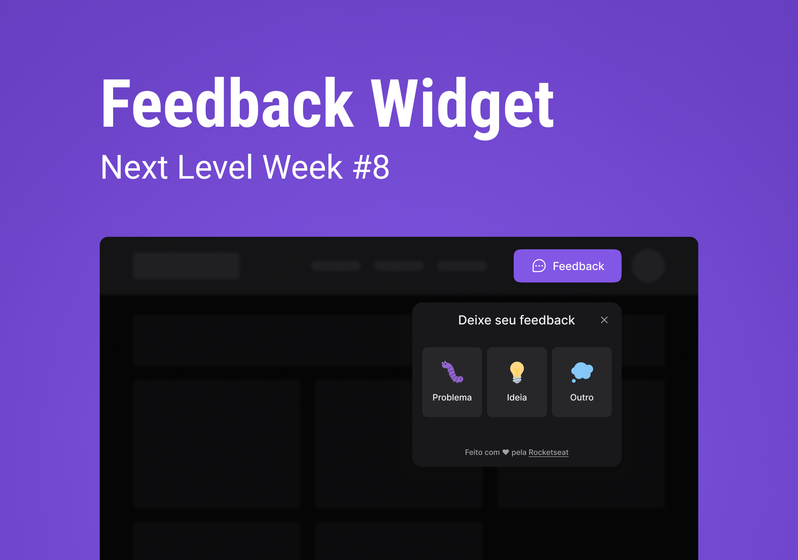

<p align="center">
  
</p>

<h4 align="center"><a href="https://feedget-sampaiocode.vercel.app">Clique para visitar o projeto</a></h4>

---

## 💻 Sobre o projeto

Esse projeto foi desenvolvido durante o NLW Return Impulse da [Rocketseat](https://www.rocketseat.com.br/). O projeto tem o objetivo de coletar o feedbacks dos usuários sobre problemas, ideias e outros. Além disso, o projeto também conta com a funcionalidade de envio de e-mail com o tipo de feedback, comentário e screenshot da tela.

## 🛠️ Tecnologias

Este projeto foi desenvolvido utilizando as seguintes tecnologias:

- [ReactJS](https://reactjs.org/)
- [React Native](https://reactnative.dev/)
- [TypeScript](https://www.typescriptlang.org/)
- [Expo](https://expo.io/)
- [Tailwind CSS](https://tailwindcss.com/)
- [Vitejs](https://vitejs.dev/)
- [Express](https://expressjs.com/)
- [Axios](https://axios-http.com/ptbr/)
- [Prisma](https://www.prisma.io/)

## 🚀 Iniciando

### Requisitos

- [Node.js](https://nodejs.org/en/)
- [Yarn](https://classic.yarnpkg.com/) ou [npm](https://www.npmjs.com/package/npm)
- [Expo CLI](https://docs.expo.dev/workflow/expo-cli)

**Clone o projeto e acesse a pasta**

```bash
git clone https://github.com/sampaiocode/feedget.git && cd feedget
```

**Siga os passos abaixo**

### Server

```bash
# Na pasta raiz do projeto, acesse a pasta 'server'
$ cd server

# Instale as dependências
$ yarn

# Crie um arquivo '.env'
# Faça uma cópia de '.env.example' para '.env'
$ cp .env.example .env

# Inicie o servidor
$ yarn dev
```

### Web

```bash
# Na pasta raiz do projeto, acesse a pasta 'web'
$ cd web

# Instale as dependências
$ yarn

# Crie um arquivo '.env.local'
# e faça uma cópia de '.env.local.example' para '.env.local'
$ cp .env.local.example .env.local

# Inicie a aplicação
$ yarn dev
```

### Mobile

```bash
# Na pasta raiz do projeto, acesse a pasta 'mobile'
$ cd mobile

# Instale as dependências
$ yarn

# Se você vai emular com android, execute este comando
$ yarn android

# Se você for emular com ios, execute este comando
$ yarn ios

# Ou apenas inicie o pacote
$ yarn start
```

## 🔖 Layout

Você pode visualizar o layout do projeto através [desse link](https://www.figma.com/community/file/1102912516166573468). É necessário ter conta no [Figma](https://figma.com) para acessá-lo.

## 📝 Licença

Esse projeto está sob licença. Veja o arquivo [LICENÇA](LICENSE) para mais detalhes.

---

Desenvolvido com 💙 por [Deivit Eduardo](https://github.com/sampaiocode)
